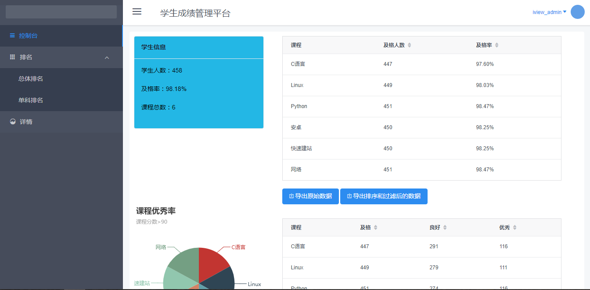
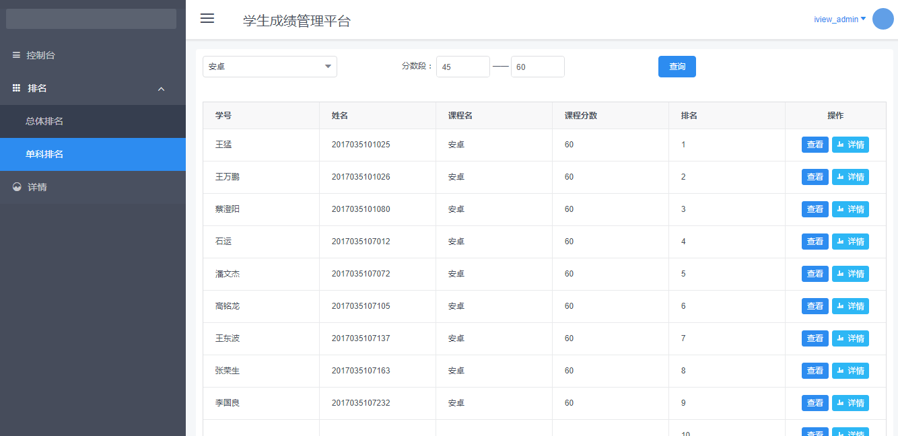
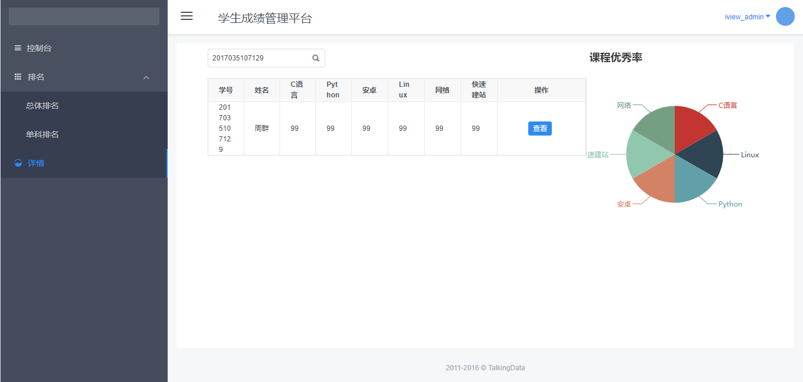

# 学生成绩管理
> 软件工程课程--团队项目
## 功能
- 用户可以选择两个CSV格式文件(第一个CSV文件包括学号,姓名,科目,成绩信息,第二个CSV文件包括科目,及格成绩,优等成绩,良等成绩)
- 计算学生的总成绩并进行排名
- 根据用户选择的科目进行单科排名
- 统计某一分段的学生数量(单科或总成绩,分段由用户输入)
- 用户可以输入学号来查询该学生的成绩信息及总成绩和单科成绩的排名
- 以上所有查到的信息,都显示科目的成绩等级

## 文件说明
TeamProject  
&nbsp;&nbsp;&nbsp;&nbsp;-- database  :数据文件  
&nbsp;&nbsp;&nbsp;&nbsp;-- impl:具体方法实现  
&nbsp;&nbsp;&nbsp;&nbsp;-- WEB-INFO:前台页面展示  
&nbsp;&nbsp;&nbsp;&nbsp;-- config.py:配置文件  
&nbsp;&nbsp;&nbsp;&nbsp;-- TeamProject.py:路由请求  
&nbsp;&nbsp;&nbsp;&nbsp;-- README.md   

## 相关技术
- 服务端：Python3.6、flask、anaconda
- 页面：vue、iview
- 网络请求：axios
- 图表：echartjs

## 安装操作
1. 下载文件
```
    git clone [URL]
```
2. 启动服务
```
    python TeamProject.py
```
3. 启动web服务,进入WEB-INFO/TeamProjectWeb路径
```
    yarn install
    yarn run dev
```

## 作品暂展示
- 登陆界面

- 首页

- 数据展示

